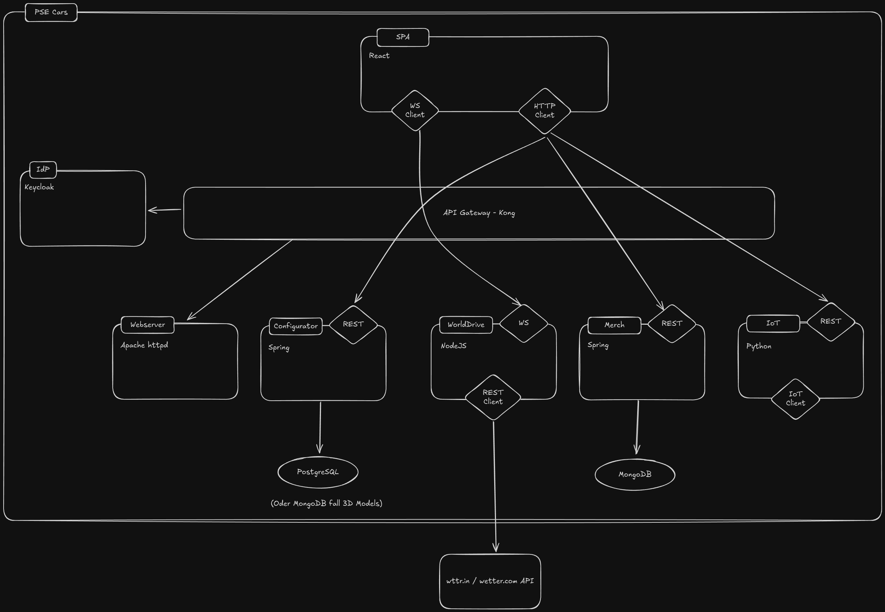

# Architecture Documentation

The PSE Cars project implements a microservices architecture with a multi page application frontend.
The architecture is depicted in the following diagram:

To edit the architecture diagram, you can head to [Excalidraw](https://excalidraw.com/#json=ujrgKpY2DVkpNmMlFyDXF,Js7jK8uEjqFlV7GC74WlrQ).

The PSE Cars project consists of the following components:
- Frontend - MPA using the Next.js framework
- API Gateway (Kong) serving as a reverse proxy for the backend services and handling authentication-related tasks
- Identity Provider (Keycloak) working together with the API Gateway
- Configurator Service (implemented with Spring) providing data for the `Cars Overview` and `Car Configurator` pages
  - PostgreSQL database to persist the configured cars
- WorldDrive Service (implemented in NodeJS) providing data for the `WorldDrive` page
  - InfluxDB database to persist the past positions of the car
  - Mosquitto MQTT broker for communication with the (mocked) car
- Merch Service (implemented with Spring) providing data for the `Merchandise` page
  - PostgreSQL database to serve the merchandise data
- IoT Service (implemented in Nest.js) serving as a proxy to the car for the `MyPSECar` page
  - Mosquitto MQTT broker for communication with the (mocked) car
