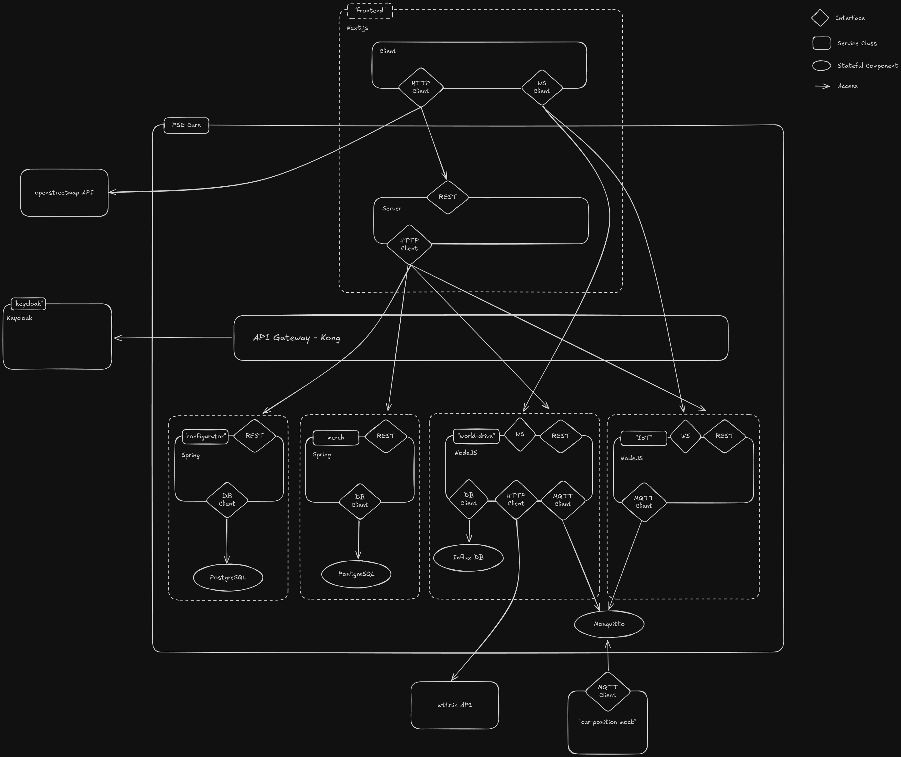

# Architecture Documentation

The PSE Cars project implements a microservices architecture with a single page application frontend.
The architecture is depicted in the following diagram:

To edit the architecture diagram, you can head to [Excalidraw](https://excalidraw.com/#json=qPRa5HvHtLyFhRTxlwJNO,ogKITKNQVfp70Fm-Bc6Fmg).

The PSE Cars project consists of the following components:
- Frontend - SPA using the React framework
- API Gateway (Kong) serving as a reverse proxy for the backend services and handling authentication-related tasks
- Identity Provider (Keycloak) working together with the API Gateway
- Webserver (Apache httpd) serving the frontend application
- Configurator Service (implemented with Spring) providing data for the `Cars Overview` and `Car Configurator` pages
  - PostgreSQL database to persist the configurated cars
- WorldDrive Service (implemented in NodeJS) providing data for the `WorldDrive` page
- Merch Service (implemented with Spring) providing data for the `Merchandise` page
  - MongoDB database to serve the merchandise data
- IoT Service (implemented in Python) serving as a proxy to the Lightbulb for the `MyPSECar` page
