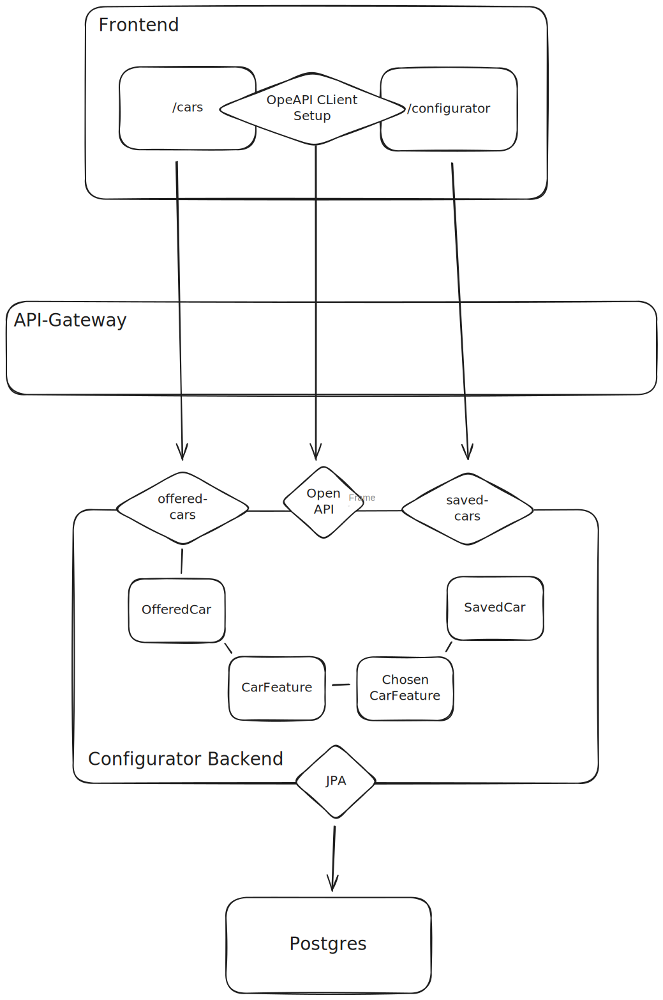

# Architectural decisions on the configurator

## Chosen technologies

 - Springboot as the backend does not have specific requirements which would require a different framework or language and it's very well known and thus well extendable and maintainable in the future
 - Spring Web MVC over webflux as no streamed responses are needed because of huge data or something similar
 - PostgresSQL as we need to handle typical RDBMS data -> no specific requirements and postgresSQL is one of the most used databases
 - Spring Data JPA as it is the most used and well known way to access a database in Spring

## Architectural decisions
 - Car Options are backend driven -> good extensibility for future admin UI where changes could be made and saved to the db instead of the need to change the code and redeploy the frontend
 - Frontend -> Backend connection is based on dynamic Open API discovery:
   - Only Backend URL needs to be known by frontend
   - With this backend URL, the client can read the Open API metadata
   - With the Open API metadata, all endpoints can be requested dynamically, independent of renamings etc.
