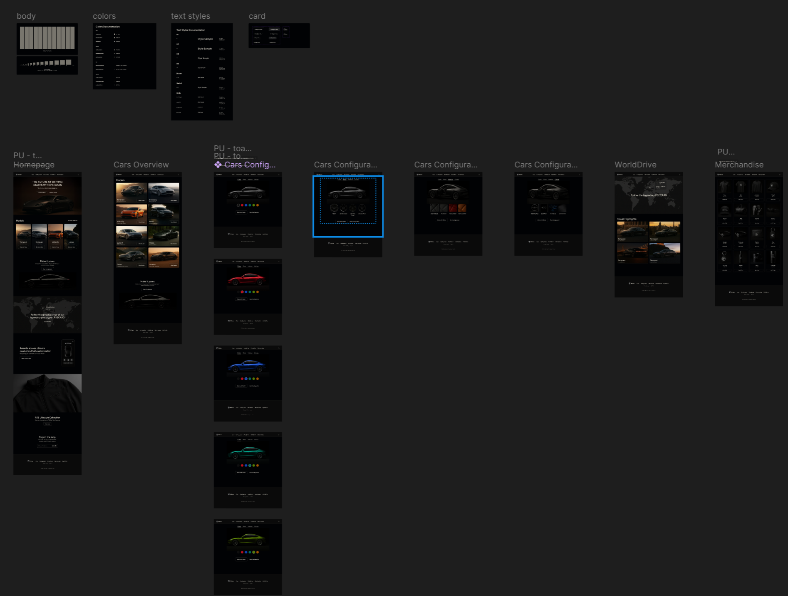

# Documentation Frontend

## Design 

Before implementation of the frontend, a design was created to visualize the user interface and user experience. A custom design system with all ressource files was created in Figma



## Tailwind CSS

Based on the design system, Tailwind CSS was used to implement the frontend. Custom variables were created to match the design.

```css
@theme {
  /* Fonts */
    --color-font-primary: #fff9eb;
    --color-font-secondary: #b9b5a9;
    --color-font-tertiary: #8e8e8e;

  /* Outline */
    --color-outline-primary: #78756D;
    --color-outline-secondary: #4B4945;
    --color-outline-tertiary: #2F2D29;

    /* Btn */
  --color-btn-surface-default: rgba(0, 0, 0, 0.1);
    --color-btn-surface-hover: rgba(255, 255, 255, 0.1);

    /* Surface */
    --color-surface-primary: #010204;
    --color-surface-secondary: #0A0A0A;
    --color-surface-tertiary: #1A1A1A;
}
```

## Next.js

Use of Next.js 15. Mostly for developer experience in this project rather than for SEO or Server Side Rendering (SSR). Most pages are client-side rendered, but the routing mechanism is used. Also, server actions are used to handle some backend interaction. 