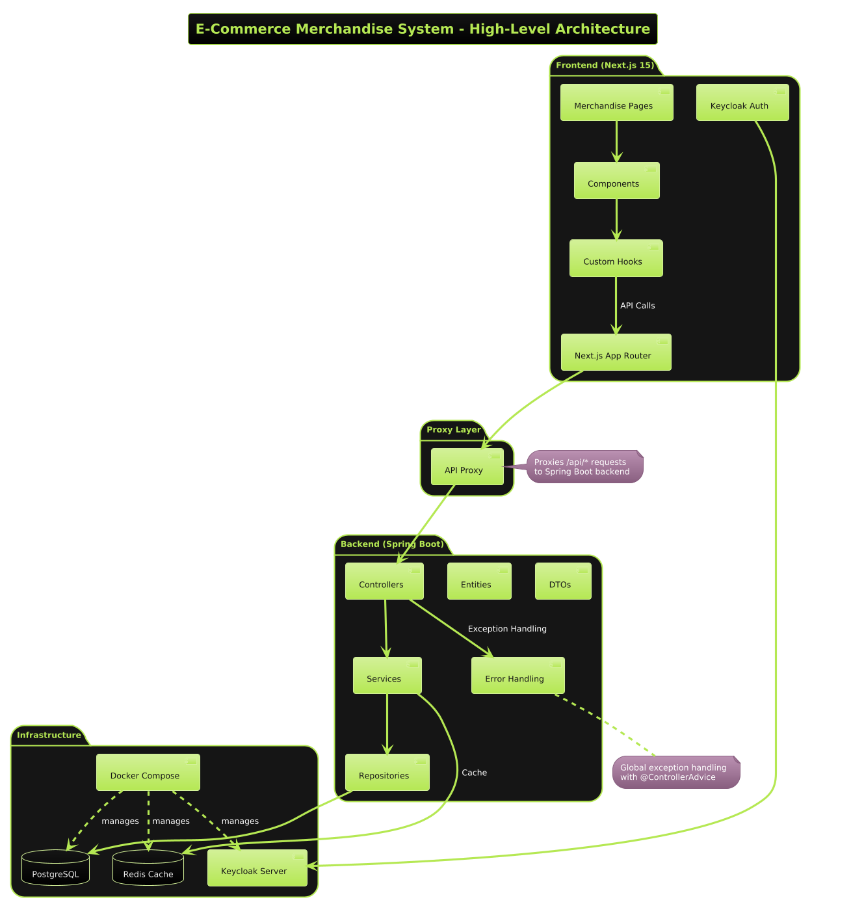

# Architectural Decisions – PSE CARS-MerchShop
Core Technology Choices
•	Spring Boot as backend framework → proven stability, extensive ecosystem, excellent auto-configuration
•	PostgreSQL as database → ACID compliance needed for transactions, strong JSON support for flexible product   attributes
•	Spring Data JPA for data access → most mature ORM for Spring, handles complex relationships well
•	Cookie-based sessions for cart persistence → enables anonymous shopping without user registration requirements.

# Architectural Patterns and Key Architectural Decisions
# ID1. Layered Architecture Pattern
Decision: Controller → Service → Repository → Entity layers
Reason: Clear separation of concerns, easier testing, team familiarity, maintainable codebase
# ID2. Session-Based Cart Management
Decision: 7-day cookie persistence with UUID session IDs
Reason: Anonymous users can shop without registration, survives browser restarts, enables horizontal scaling
# ID3. Pessimistic Locking for Stock Control
Decision: SELECT FOR UPDATE for inventory operations
Reason: Prevents overselling in concurrent scenarios, ensures data consistency for financial operations
# ID4. Service-Level Transaction Boundaries
Decision: @Transactional at service methods, not repository level
Reason: Business operations span multiple data operations, ensures atomic order creation with stock reduction
# ID5. DTO Pattern for API Communication
Decision: Separate DTOs for requests/responses, never expose entities directly
Reason: API stability independent of database changes, security (hide internal IDs), performance (calculated fields)
# ID6. Eager Loading for Cart Operations
Decision: @ManyToOne(fetch = FetchType.EAGER) for CartItem → Product relationship
Reason: Prevents lazy loading exceptions in DTOs, cart operations always need product details
# ID7. Disabled Entity Caching
Decision: Removed Redis caching for complex entities, kept for simple values only
Reason: Circular references caused serialization issues, detached entity problems, simplified architecture
# ID8. Custom Query Optimization
Decision: @Query with JOIN FETCH for cart retrieval operations
Reason: Single query loads cart + items + products, prevents N+1 query problem
# ID9. RESTful Resource Design
Decision: Resource-based URLs (/api/cart/items/{productId}) with proper HTTP methods
Reason: Standard approach, predictable for frontend developers, supports HTTP semantics
# ID10. Scheduled Cart Cleanup
Decision: Hourly cleanup of expired carts via @Scheduled tasks
Reason: Prevents database bloat, maintains performance, handles abandoned sessions automatically
# ID11. Docker Compose for Development
Decision: Complete environment in docker-compose.yml (app, db, redis, keycloak)
Reason: Consistent development setup, easy onboarding, version-controlled infrastructure

