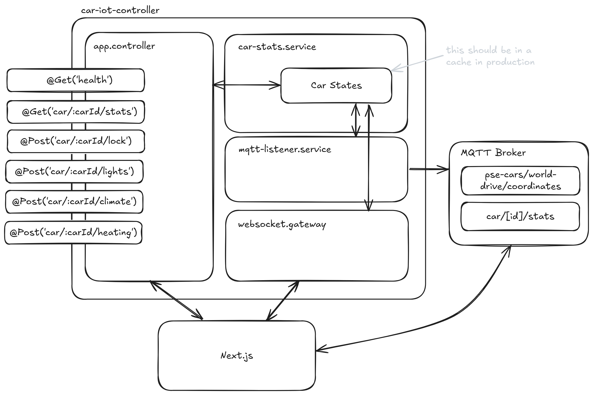

# Documentation My-PSE-Car

## Service Architecture

## Architectural Decisions

- Technology:
  - **NestJS**: Mostly used because of integrated TypeScript support and to use the same language as in the frontend. Also I wanted to try out NestJS to be honest
  - **Mosquitto**: Used as a message broker for most of the communication. Closest to to how it would be in a real car

- Built an endpoint for each state change of the car like "lock", "light", and so on. This is specifically done to later on handle the car state changes differently. For example, if the car is locked, the light should be turned off. This is not implemented yet, but the architecture is ready for it.
- Earlier versions just had an "publishMessage" endpoint which was deeply insecure
- Car data is mocked on the IoT Service and changes every second to simulate a real car
- Position data is the same as the WorldDrive Service, so the car can be moved around the world

## Future Improvements

- CarStates are held in memory in the IoT Service for now. In the future, this should be replaced by a database to persist the car states. This is because the car states are not needed for long-term storage and are only used for the current session.
- The routes should be secured with authentication and authorization. For now you can access everything if you know the carId. This should be done using the Keycloak