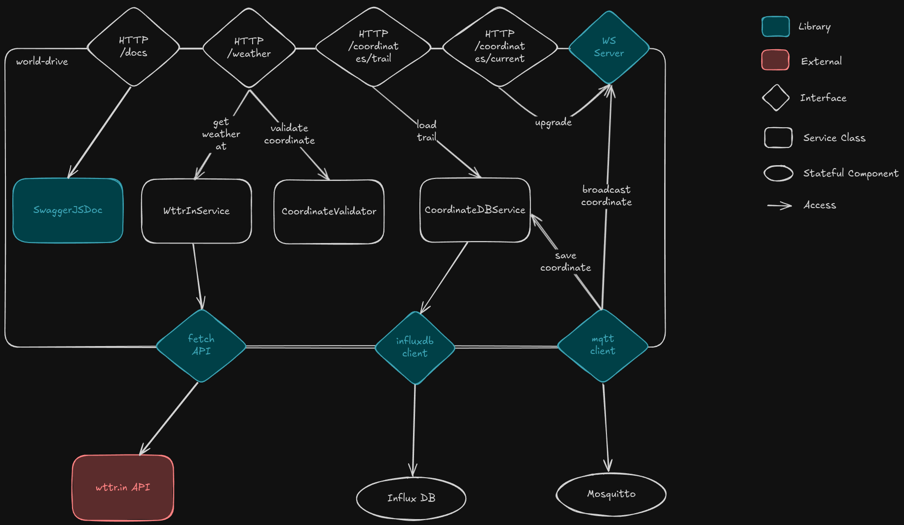

# Architecture of the World Drive component

The architecture of the World Drive component is depicted in the following diagram:

To edit the architecture diagram, you can head to [Excalidraw](https://excalidraw.com/#json=ZAfyMPgf_YZZCTXrvCH1X,YUfqo1banusGMVeqvORGPQ).

### Chosen Technologies

- Node.js as the backend language, which is well-suited for handling asynchronous operations and real-time data processing.
- Express.js as the web framework, providing a simple and flexible way to build web applications and APIs.
- InfluxDB as the time-series database, which is optimized for storing and querying time-stamped data, making it ideal for tracking the car's position over time.
- Mosquitto MQTT broker for handling real-time communication with the car, allowing for efficient message passing and event-driven architecture. Also, Mosquitto is open-source.
- SwaggerJSDoc for API documentation, enabling easy in-code documentation of the endpoints.

### Architectural Decisions

- Architecture inside the component is three-layered where possible:
  - **Controller Layer**: Handles incoming requests and routes them to the appropriate service methods.
  - **Service Layer**: Contains the business logic and interacts with the database or external services.
  - **Repository Layer**: Manages data access and interactions with the InfluxDB database.
  - The MQTT client violates this architecture pattern knowingly, since it has to directly update the user via WebSocket to ensure the most up-to-date data in the frontend.
